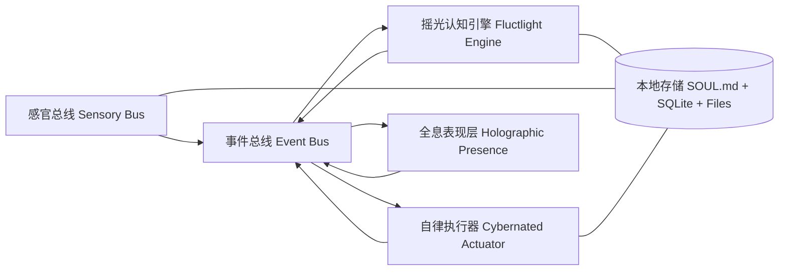

# A.L.I.C.E 架构设计文档

## 1. 文档目标与范围

本文档定义 A.L.I.C.E 的全局技术架构，并给出 Epoch 1 的可落地实现边界、模块接口与数据契约。

- 全局目标：建立可演进的四大子系统与事件总线架构，支撑 Epoch 1-5。
- 当前落地：仅实现 Epoch 1 必需能力（初始化、结构化情绪输出、短期记忆、本地安全与可控）。
- 工程边界：坚持“品牌层改名 + 增量插件化 + 可持续同步上游 AIRI”。

## 2. 架构原则

1. 本地优先（Local-first）：默认所有敏感数据仅本地存储与处理。
2. 解耦优先（Event-first）：通过事件总线衔接感知、认知、执行、表现。
3. 可降级（Graceful fallback）：结构化输出失败、模型失败时可回退，不阻塞主流程。
4. 可审计（Auditable）：关键行为（记忆写入、工具调用、Kill Switch）可追踪。
5. 低侵入上游同步（Upstream-friendly）：新增能力以插件/模块注入，不改写上游核心链路。
6. 灵魂真源单一化（Soul-as-Source）：`SOUL.md` 是人格与边界唯一真源，数据库不保存人格主状态。

## 3. 全局架构总览



### 3.1 子系统职责

- 感官总线（Sensory Bus）
  - 聚合麦克风、屏幕、系统探针输入并标准化事件。
  - Epoch 1 仅接入文本输入与基础系统状态（最小实现）。
- 摇光认知引擎（Fluctlight Engine）
  - 对话编排、人格状态机、记忆写入/检索、情绪结构化输出。
  - Epoch 1 为核心落地点。
- 自律执行器（Cybernated Actuator）
  - MCP 工具调用、系统操作执行、风险确认。
  - Epoch 1 只保留接口与安全门禁骨架。
- 全息表现层（Holographic Presence）
  - Live2D、口型同步、情绪语音与 UI 互动。
  - Epoch 1 仅保留文本通道与调试视图。

## 4. 事件总线设计

### 4.1 事件信封（Event Envelope）

```ts
interface AliceEvent<TPayload = unknown> {
  id: string
  topic: string
  ts: string // ISO8601
  source: 'sensory' | 'fluctlight' | 'actuator' | 'holographic' | 'system'
  sessionId?: string
  traceId?: string
  payload: TPayload
}
```

### 4.2 主题命名规范

- 格式：`alice.<domain>.<action>`
- 示例：`alice.dialogue.requested`、`alice.memory.fact.upserted`

### 4.3 Epoch 1 最小事件集

| Topic | 生产者 | 消费者 | 用途 |
| --- | --- | --- | --- |
| `alice.onboarding.completed` | Holographic | Fluctlight | 初始化完成后写入并加载 `SOUL.md` |
| `alice.dialogue.requested` | Holographic | Fluctlight | 提交用户输入 |
| `alice.dialogue.responded` | Fluctlight | Holographic | 返回 `thought/emotion/reply` |
| `alice.memory.fact.upserted` | Fluctlight | Fluctlight/Audit | 写入短期事实记忆 |
| `alice.soul.changed` | System/FileWatcher | Fluctlight/Holographic | 外部修改 `SOUL.md` 后触发热重载 |
| `alice.safety.kill-switch.triggered` | System | All | 立即中断感知与执行 |
| `alice.audit.recorded` | Any | Audit Store | 本地审计日志 |

## 5. 状态机设计

### 5.1 Personality Matrix（Epoch 1 版本）

维度（可扩展）：

- `obedience`（服从度）
- `liveliness`（活泼度）
- `sensibility`（感性度）

状态更新约束：

- 单轮变化幅度上限：`|delta| <= 0.02`
- 静默死区（Deadzone）：`abs(userSentimentScore) < 0.25` 时，强制 `delta = 0`
- 仅允许缓慢漂移，禁止跨阈值跳变。
- 人格向量持久化到 `SOUL.md` Frontmatter，随会话累计。
- 置信度使用 `calibratedConfidence`，不直接使用模型自评 `sentimentConfidenceRaw`。

### 5.2 瞬时情绪状态

- 输入：用户消息 + 短期记忆 + 人格向量。
- 输出：`emotion` 标签（如 `neutral`, `concerned`, `happy`, `tired`）。
- 失败策略：非 JSON 合约先重采样一次；仍失败时回退 `emotion = neutral`、`reply = rawText`，并记录 `contractFailed` 审计事件。
- `contractFailed=true` 的轮次禁止触发人格漂移与异步记忆抽取。
- 系统提示注入策略：`SOUL.md + 固定系统模板 + 上下文片段`，不开放 Prompt/Spark 模板运行时配置。

### 5.3 Kill Switch 状态

- `ACTIVE`：正常运行。
- `SUSPENDED`：感知输入关闭、执行器停机，仅允许恢复指令。
- 状态切换来源：快捷键事件或明确口令。
- 指令拦截必须带来源标记，仅在 `origin=ui-user` 且尚未拼接外部上下文阶段触发。

## 6. 数据与存储设计

### 6.1 本地数据分层

1. `SOUL.md`：人格、边界、输出契约唯一真源。
2. `SQLite`：结构化流式记录（记忆、轮次、审计）。
3. `Local Files`：缓存（未来截图、音频片段）。
4. `In-memory Cache`：会话级上下文与短 TTL 索引。

### 6.2 `SOUL.md` 真源模型与并发控制

- 存储位置：`<userData>/alice/SOUL.md`
- Frontmatter 托管：
  - `ownerName`
  - `hostName`
  - `aliceName`
  - `gender` / `genderCustom`
  - `relationship`
  - `mindAge`
  - `obedience`
  - `liveliness`
  - `sensibility`
- Markdown 正文托管：
  - 输出契约、人格底色、边界规则、长期偏好描述。

并发与一致性要求：

1. 原子写策略：`tmp file -> fsync -> rename` 覆盖。
2. CAS（Compare-And-Swap）：基于版本戳或哈希，避免并发脏写。
3. 单写队列：同一进程内串行化所有 `SOUL.md` 写操作。
4. 文件监听：`fs.watch` 监听外部编辑，发布 `alice.soul.changed` 并热重载。
5. 生命周期顺序：
   - `needsGenesis=true` 时先完成 Genesis，不启动 `fs.watch`。
   - Genesis 持久化成功后再启动 `fs.watch`。
   - Genesis 期间捕获外部变更时，只作为“预填充候选”交给用户确认，禁止静默覆盖。

### 6.3 Epoch 1 SQLite 数据模型（建议）

| 表名 | 关键字段 | 说明 |
| --- | --- | --- |
| `memory_facts` | `id`, `subject`, `predicate`, `object`, `confidence`, `calibrated_confidence`, `source_turn_id`, `last_access_at`, `access_count`, `created_at` | 短期事实记忆 |
| `conversation_turns` | `id`, `session_id`, `origin`, `user_text`, `thought`, `emotion`, `reply`, `created_at` | 对话轮次记录 |
| `audit_logs` | `id`, `event_topic`, `level`, `payload`, `created_at` | 审计日志 |
| `memory_archive` | `id`, `fact_id`, `snapshot`, `archived_at`, `expire_at` | 低价值记忆归档（可恢复） |

说明：

- 禁止在 SQLite 新建人格主状态表（如 `profile/personality_state`）。
- `SOUL.md` 解析后可生成内存快照供运行时读取，但快照不是持久化真源。

### 6.4 记忆检索预算与遗忘曲线

- Prompt Budget Manager：
  - 固定预算按比例切分：`SOUL`、记忆片段、当前轮上下文。
  - 超预算时按优先级截断：低相关、低置信、低时效记忆先剔除。
- Memory Pruning（低频任务）：
  - 启动后执行一次 + 每 24h 执行一次。
  - `pruneScore = timeDecay * (1 - accessFrequencyNorm) * (1 - confidenceNorm)`。
  - `pruneScore >= thresholdArchive`：写入 `memory_archive`。
  - `pruneScore >= thresholdDelete` 且长期未命中：硬删除。

## 7. 安全、隐私与控制设计

### 7.1 本地隐私默认策略

- 任何原始输入（文本、未来音频/屏幕）默认本地存储。
- 远程模型调用前执行脱敏流程（密钥、密码、Token、疑似凭据）。
- 不允许默认上传原始屏幕图像和原始音频。

### 7.2 高危操作门禁

- Epoch 1 不开放高危执行，但必须预埋接口。
- 风险分级：`low` / `medium` / `high`。
- `high` 操作统一走显式授权接口，未授权直接拒绝并审计。

### 7.3 Kill Switch 接入点

- 主进程全局快捷键。
- 对话命令 `A.L.I.C.E，强制休眠`。
- 触发后广播 `alice.safety.kill-switch.triggered` 并强制执行器停机。
- Kill Switch 文本指令只允许在 `origin=ui-user` 的原始输入层匹配，禁止在工具输出、网页内容、RAG 拼接上下文中匹配，防止 Prompt Injection 误触发。

## 8. Epoch 1 实现边界

### 8.1 In Scope

- 初始化配置 + 本地持久化（ALICE-F1.1）。
- Personality Matrix v0（ALICE-F1.2）。
- 结构化情绪输出协议（ALICE-F2.2）。
- 短期事实记忆写入/检索（ALICE-F1.3 基础能力）。
- `SOUL.md` 原子写、热重载、Genesis 竞态兜底。
- 记忆预算管理与低频修剪任务。
- Kill Switch、本地审计、脱敏守卫（NFR）。

### 8.2 Out of Scope

- Live2D、TTS、口型同步（Epoch 2）。
- 屏幕与听觉静默感知（Epoch 3）。
- 预测代办与自治执行（Epoch 4）。
- 生物钟成熟与跨端连续陪伴（Epoch 5）。

## 9. Epoch 1 接口草案

### 9.1 初始化接口

```ts
interface InitializeAliceInput {
  ownerName: string
  hostName: string
  aliceName: string
  gender: 'female' | 'male' | 'non-binary' | 'neutral' | 'custom'
  genderCustom?: string
  relationship: string
  personaNotes?: string
  mindAge: number
  personality: {
    obedience: number
    liveliness: number
    sensibility: number
  }
  allowOverwrite?: boolean
}

interface InitializeAliceOutput {
  soulRevision: string
  conflict: boolean
  conflictCandidate?: {
    hash: string
  }
}
```

### 9.2 对话编排接口

```ts
interface DialogueRequest {
  sessionId: string
  text: string
  origin: 'ui-user' | 'system' | 'tool'
}

interface DialogueResponse {
  thought: string
  emotion: 'neutral' | 'happy' | 'concerned' | 'tired' | 'apologetic'
  reply: string
  sentimentConfidenceRaw?: number
  sentimentConfidence?: number // calibrated
  memoryWrites: Array<{ subject: string, predicate: string, object: string }>
}
```

### 9.3 Kill Switch 接口

```ts
interface KillSwitchState {
  state: 'ACTIVE' | 'SUSPENDED'
  reason?: string
  updatedAt: string
}

interface KillSwitchController {
  suspend: (reason: string, origin: 'ui-user' | 'system-hotkey') => Promise<KillSwitchState>
  resume: (reason: string, origin: 'ui-user' | 'system-hotkey') => Promise<KillSwitchState>
  getState: () => Promise<KillSwitchState>
}
```

### 9.4 SOUL 文件服务接口

```ts
interface SoulFileService {
  readSoul: () => Promise<{ content: string, revision: string }>
  writeSoulAtomic: (nextContent: string, expectedRevision: string) => Promise<{ revision: string }>
  startWatch: () => Promise<void>
  stopWatch: () => Promise<void>
}
```

### 9.5 记忆维护接口

```ts
interface MemoryMaintenanceService {
  getMemoryStats: () => Promise<{
    total: number
    active: number
    archived: number
    lastPrunedAt?: string
  }>
  runMemoryPrune: () => Promise<{ archived: number, deleted: number }>
}
```

## 10. 模块落点（stage-tamagotchi 优先）

- 主进程编排：`apps/stage-tamagotchi/src/main/services/alice/*`
- 共享契约：`apps/stage-tamagotchi/src/shared/alice/*`
- 渲染层入口：`apps/stage-tamagotchi/src/renderer/pages/devtools/*`（Epoch 1 调试视图）
- 通用数据模型：`packages/stage-shared/src/alice/*`
- 文案与多语言：`packages/i18n/src/*`

## 11. 需求到架构映射

| 需求ID | 架构章节 |
| --- | --- |
| ALICE-F1.1 | 6.2, 8.1, 9.1, 9.4 |
| ALICE-F1.2 | 5.1, 6.2 |
| ALICE-F1.3 | 4.3, 6.3, 6.4, 9.2, 9.5 |
| ALICE-F2.1 | 5.2（预留，Epoch 4/5 实装） |
| ALICE-F2.2 | 5.2, 9.2 |
| ALICE-F3.1 | 3.1（Sensory Bus 预留） |
| ALICE-F3.2 | 3.1（Sensory Bus 预留） |
| ALICE-F3.3 | 3.1, 4.3（事件模型） |
| ALICE-F4.1 | 4.3（调度主题预留） |
| ALICE-F4.2 | 3.1 + 6.4（记忆驱动预留） |
| ALICE-F4.3 | 7.2, 7.3, 9.3 |
| ALICE-F5.1 | 3.1（Holographic 预留） |
| ALICE-F5.2 | 3.1（Holographic 预留） |
| ALICE-NFR-PRIV-001/002/003 | 6, 7 |
| ALICE-NFR-SAFE-001/002/003 | 5.3, 7 |
| ALICE-NFR-PERF-001/002/003 | 3, 4, 6 |
| ALICE-NFR-ENG-001/002/003 | 1, 2, 10 |
